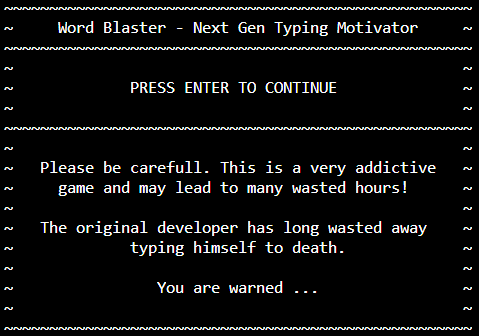
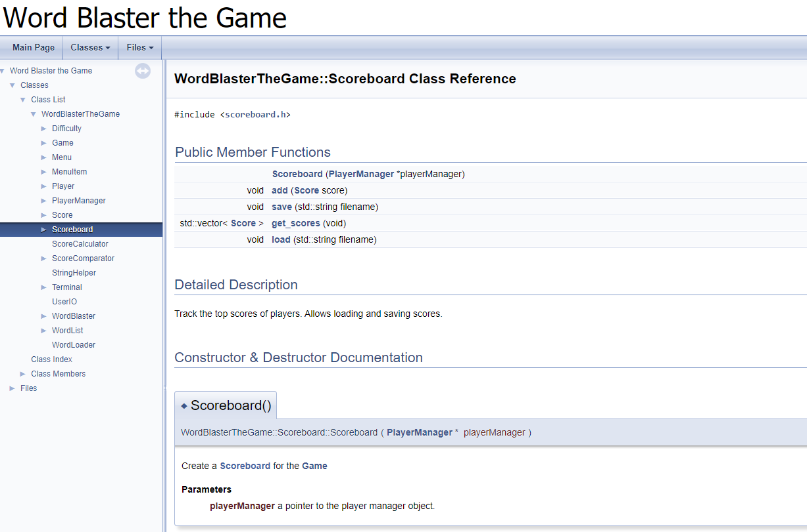

# Word Blaster

A C++ typing game.

Word Blaster challenges the player to type a list of words as fast as possible and without mistakes. It tracks the scores of the player using a scoreboard and also allows the user to select the appropriate difficulty.

The words are selected randomly from text files located on the file system.



## Building and running the game

This project is equipped with a make file to build and run the game. Just run the command bellow.

```cpp
make run
```

### On Linux

The only code that is operating system dependent is `Terminal`. It makes use of the `getch()` function of `conio.h` that is only available on Windows. An alternative is provided for Linux in the code.

The source code is equipped with pre-processor directives that detect the current operating system.

### Doxygen

This project contains doxygen comments which can be generated into a fancy API site. Just install [doxygen](http://www.doxygen.nl/) and run the `doxygen` or `make docs` command (you may need to add doxygen to your PATH) in the root directory of this project. The html output can be found at [./docs/html/index.html](./docs/html/index.html).



## Part of C++ Course

This project was a challenge for the students of the VIVES University College in Bruges as part of the C++ course.

## Original Assignment

Build a word typing game that challenges the user to type over words as fast as possible.

Let the user login using a nickname. Also allow selection of difficulty.

Select random words from a file. Can be plain text file. Make sure that the difficulty influences the word selection from the file.

The score should be calculated based on the correctness of the user's typing and also the speed with which the user finishes each challenge. Calculate a score based on at least these parameters.

Allow the score to be saved to a file and displayed in a scoreboard.

Try to make the game a bit more appealing by using for example ascii art or other techniques for visualization inside the console.

Document the project with a decent `README.md` and UML class diagrams. Also explain new techniques or things you used to build the app.

Also include a `Makefile` so the project can be easily built using a single `make` command.

## Steps Taken

Step titles are same as the commit messages. This way you can follow along.

### Step 1 - Simple Hello World

Output basic message and make sure everything (compiler and makefile) works.

### Step 2 - A WordList class

WordList can track a list of words and provide randomly selected word.

Single responsibility so no loading from file and such. Responsibility of another class.

### Step 3 - A WordLoader class

Words need to be loaded from a file. `WordLoader` loads words from a file and places them in a `WordList`.

Later on different files will exist for the different difficulties. However, `WordLoader` does not have to know this.

`WordLoader` does not need to keep any state for its single method. Because of this the method is made `static` which means it is not called on an object of `WordLoader` but rather on the class itself.

### Step 4 - Some Game Logic

Basic game logic consists of asking the user to repeat a certain number of words. This can be accomplished by a simple `for` construct. In this step the code is placed in main. Next steps will refactor this.

### Step 5 - A Game class

This kind of logic cannot be kept in main. This typically screams for a `Game` class with a basic `play()` method. `WordList` will also need to be moved as attribute of `Game` (composition).

Tip: Just move the `for` loop into the `play()` method and check out what extra information you need for the code to work.

This still requires some serious refactoring.

### Step 6 - User Input Output class

Problem with the current `Game` class is the fact that it handles user IO. If possible, it is a good idea to separate the user IO from the game logic. This would actually allow the game to be used with a GUI instead of a terminal and only a single class would have to be provided.

If this separation is done early in the development process, it's a much less painful operation.

Basically we need a class that has some methods that can request a word from the user, output the next word, output some stats about his/her score and so on. This class will not need to track any state as each method call will require all the needed information to be supplied. The `Game` class tracks all state here.

The end result should be a `Game` class without a single `cout`, `getline` or `cin`. The `UserIO` methods should not contain any game logic. This means that for example the comparison of the generated word and the user input should happen in the game class.

### Step 7 - A Score class

At the moment no score is tracked for the player. One could state that we could just track the number of wrongly typed words in the Game class but if the scoring mechanism will get a bit more complex, it will needs it's own class.

For the moment we can use the length of the word as a score parameter. Later we can add timing and such.

In one of the following steps we will also be adding a `Player` to the game to which an object of `Score` will belong.

Game will need to track the `Score` of the current game. An attribute can be added to the class for this.

Let's also add a method to `UserIO` to output the final score of the user.

### Step 8 - A Player class

It's time to add a player. This will be required once we want to start keeping a score board.

When the application starts we will ask the user for a nickname and store this inside of the `Player` class. The player should then be injected into the `Game` object upon construction. This will later allow us to ask the player if he/she wishes to start another game without requiring hem/her to enter the nickname again.

We will also alter the `Score` class so it keep a pointer to the `Player` to which the score belongs. This can also be accomplished via the constructor.

Why not add a Score object as an attribute to Player? Well basically because a Player will be able to have multiple score's in the `Scoreboard`. That would mean we would have to track these in a list (inside of player). On top of that the Player object doesn't really need to know all of its scores. The Scoreboard will need to track these.

The Score object of `Game` should also be moved in the `play` method as a local variable (instead of an attribute) for a couple of reasons:

* we only need it in the play method
* every time play is called a new score is required
* the constructor of game takes in a Player object, we cannot use a pointer to this object to initialize score as it is a copy which will go out of scope after the constructor is done.

If we were to follow this route (as an attribute of game) we would need to create the score on the heap.

### Step 9 - Refactor IO a bit

While we have some functionality already, the output looks really bad. Time to refactor the terminal output a bit.

Maybe we should build some sort of screens with similar layout.

For example:

```text
~~~~~~~~~~~~~~~~~~~~~~~~~~~~~~~~~~~~~~~~~~~~~~~~~~~
~ Word Blaster - Next Gen Typing Motivator        ~
~~~~~~~~~~~~~~~~~~~~~~~~~~~~~~~~~~~~~~~~~~~~~~~~~~~

Welcome to Word Blaster
Your next gen typing experience

PRESS ENTER TO CONTINUE
```

By adding some private methods such as `show_heading()` to `UserIO`, each output screen can be made similar in layout.

### Step 10 - A ScoreBoard class

Typically a game tracks the scores of the players between different game sessions by saving the scores in a file. These will then be loaded when the user starts the game.

We will start of with a `Scoreboard` class that can track a list of scores. Using an `std::vector` this will be easiest.

An object of `Scoreboard` can then be added to the game. Then the score of the player can be added to the board once the game is finished.

### Step 11 - Saving the Scoreboard

To save the scores we will be making use of a simple separator between the score and the player name. CSV (Comma Separated Values) is a popular format where each property is separated with a comma and each entry is saved as a single line. This parses more easily after the file has been loaded too.

To be able to save the player name along with the score we will also need a `get_player()` method for `Score`.

### Step 12 - Displaying the Scoreboard

To display the scoreboard we will need to add a method to the `UserIO` class. However to be able to access the actual score objects a method `get_scores()` will need to be added to `Scoreboard` class.

### Step 13 - Loading the Scoreboard

It is time to load the scoreboard from the scores file before the user plays the game. Since the CSV format is used, it's actually quitte easy to load the scores from the file.

We will need to take the players into account for the scores. For example we should not create a new player object if the player already exists in the scoreboard. All scores of the same player should reference the same player object.

To be able to create a `Score` object based on a player and a score we will also need to add a second constructor to `Score`.

We should make a destructor for Scoreboard that deletes the Player objects that were created on the heap but we have a problem here that we will need to address in the next step.

### Step 14 - Player Problem

We created a problem here. A player object exists in the game that can be references by score objects in the scoreboard (newly added scores). Next to that the other scores reference player objects that were created on the heap inside the Scoreboard. If the scoreboard is destructed, we are obligated to delete the players on the heap. But this cannot be done for the scores that reference the player in the Game. This would cause undefined behavior (thats an object on the stack).

What we require is a single place where the player objects are created and destroyed (all of them). We could do this in the Scoreboard but it's less logical because that would mean that the Scoreboard would even need to track players that don't even have a scoreboard entry yet.

A better option is to create a `PlayerManager` class that tracks all players and creates a new player if required. We inject a pointer to this object in both `Game` and `Scoreboard`.

This also requires some refactoring of the main.

### Step 15 - Sorting and Limiting the Scores

For the moment scores are not sorted in the `Scoreboard`. There is also no limit on how much scores can be added to the scoreboard.

The fun thing here is that our `Score` objects are stored in an `std::vector` which alsready has a `sort()` method. There is however a small catch here. `std::vector` does not know how to sort `Score` objects. This problem can however be overcome by supplying a comparator method that needs to return `true` or `false` as an answer to the question: is `first` score smaller than `second` score.

A basic example can be found at [http://www.cplusplus.com/reference/algorithm/sort/](http://www.cplusplus.com/reference/algorithm/sort/).

Let's also add a `comparators` directory below `lib` as a start for adding some hierarchy to our files.

### Step 16 - Adding Different Difficulties

The difficulty can best be implemented using a class enum.

This require a couple of changes:

* the difficulty will determine which list of words needs to be loaded
* scoreboards to be loaded as the difficulty is changed because each difficulty will have it's own scoreboard.

We will set the default difficulty of `Game` to `NORMAL` and add a method `change_difficulty()`.

### Step 17 - Fix Scoring

Currently the score only uses the word length to determine the score. To differentiate the score of players we should add parameters such as:

* typing speed (for example measure time it took to type the answer)
* the length of the word
* the difficulty setting

For this we will have to refactor the Score class a bit. Actually Score is not more than a data object and it does not have to know about the mechanism that determines the actual score (would require dependency for `Difficulty` and timing). A better option is to create a `ScoreCalculator` helper class.

### Step 18 - Building a Menu

At the moment the game is still missing a big component. A menu that allows us to present options to the user, switch between the screens and allows a player to select for example to play again.

Let's start building a menu that can present different options to the player. Basically a menu is a list of labels or in other words an `std::vector` of `std::string` objects.

Let's test the Menu by creating a selection menu for the difficulty. Actual item selection will be implemented in the next step.

### Step 19 - A Selection Menu

While it's perfectly possible for us to ask the user "please type the menu option you wish to apply" or something similar, but it would be much cooler if we were able to use the arrow keys to move up and down the menu and enter to select an item.

Let's add some functionality to the menu that will allow us to select the next and previous item.

Next we also need to capture key presses from the user. This is a bit trickier. It can be achieved using the function `getch()` but the problem is that this is only available on Windows by default via the `conio.h` header. A linux alternative should be `ncursus`. For the moment we will need to keep in mind that this will only work on Windows.

Let's add a helper class `Terminal` for the keypress functionality.

More info at:

* [getch and arrow codes](https://stackoverflow.com/questions/10463201/getch-and-arrow-codes)
* [Where is the conio.h header file on Linux?](https://stackoverflow.com/questions/8792317/where-is-the-conio-h-header-file-on-linux-why-cant-i-find-conio-h)

### Step 20 - A Main Menu

Time to create a main menu:

* Play New Game
* Change Difficulty
* Show Scoreboard
* Exit

We are missing some functionality here to accomplish navigation in the game between different "screens". This can be fixed by changing the menu items from `std::string` to an object of for example `MenuItem` with a `label` and a `nextScreen` attribute. `nextScreen` can then be an enum that defines where the application should navigate to when the user selected the option.

Some refactoring of `UserIO` is also required.

### Step 21 - A WordPlaster Application

A problem that has snuck on upon is the fact that the main and the `UserIO` class are knowing more than they should. `UserIO` for example knows what difficulties there are. It also knows about the menu items. This is not good practice.

The solution lies in a `WordBlaster` class that manages the whole system. This one can know about the menu, difficulty and such.

This class is not to be confused with the `Game` class, which knows about the game logic itself.

In this step we'll start with the refactor process of `main()`.

### Step 22 - Refactoring UserIO

So let's refactor everything out of `UserIO` that does not belong there. We may need to alter some minor things in certain classes. Below is an overview of the most important changed.

* Move `clear_terminal()` to the class `Terminal` and call it `clear()`.
* Create method `UserIO::request_menu_selection()` that knows nothing of the content of the menu but just allows the user to select an item from it. The actual menu creation is then moved to the `WordBlaster` class.
  * This allows us to remove the `UserIO::show_main_menu()`
  * This allows us to remove the `UserIO::request_difficulty()`
* Add a `title` to the `Menu` class.

Do note that `UserIO` still knows about the `Menu` class and such. However, it does not know what items are in the menu class.

### Step 23 - Depending on Difficulty

At the moment quitte a lot of things are depending on the difficulty. While there is no real way around this we can however change `Difficulty` to become a class instead of just an enum. That way we can move some small code parts into the `Difficulty` class.

### Step 24 - Fix the Number of Words

Oops. Looks like we've been constantly testing the game with two words and also limited dictionaries. Time to fix this to a bigger value.

Found a huge list of words at [https://github.com/dwyl/english-words](https://github.com/dwyl/english-words).

Quick and dirty solution to filter the words into the different difficulties:

```cpp
#include <iostream>
#include <fstream>

using namespace std;

int main() {
  ifstream input;
  input.open("./dictionaries/words_alpha.txt");

  ofstream easy;
  easy.open("./dictionaries/easy.txt");

  ofstream normal;
  normal.open("./dictionaries/normal.txt");

  ofstream hard;
  hard.open("./dictionaries/hard.txt");

  do {
    std::string word;
    std::getline(input, word);

    if (word.length() < 5) {
      easy << word << endl;
    } else if (word.length() < 8) {
      normal << word << endl;
    } else {
      hard << word << endl;
    }
  } while (input.good());

  input.close();
  easy.close();
  normal.close();
  hard.close();

  return 0;
}
```

### Step 25 - Going Crazy on Style

Made some "small" alterations to the style of the different screens and created some `StringHelper` methods to for example center strings inside of the screen boundary box.
